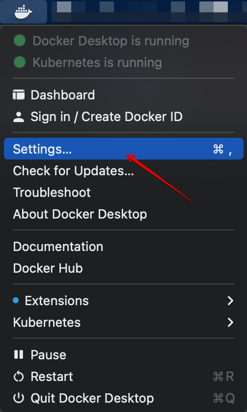
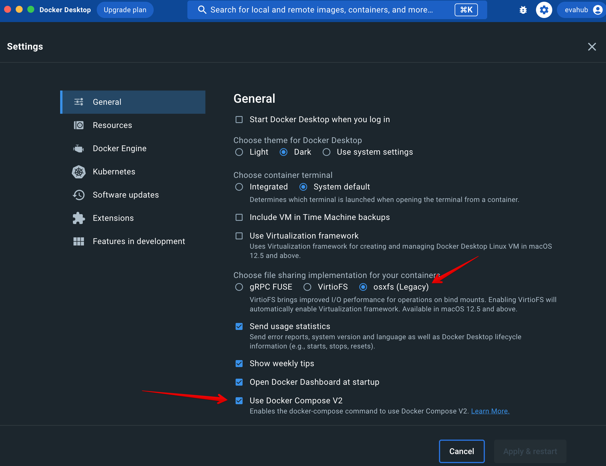
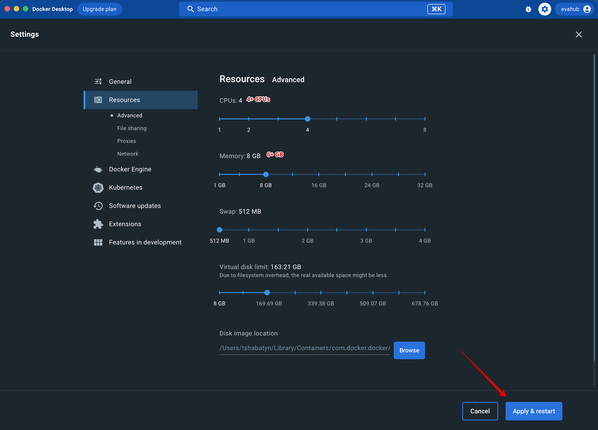
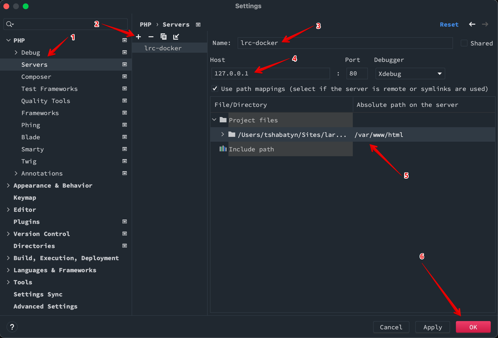
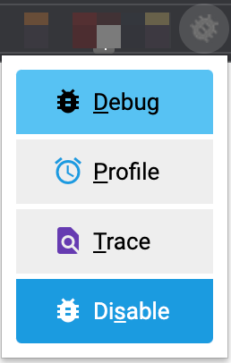
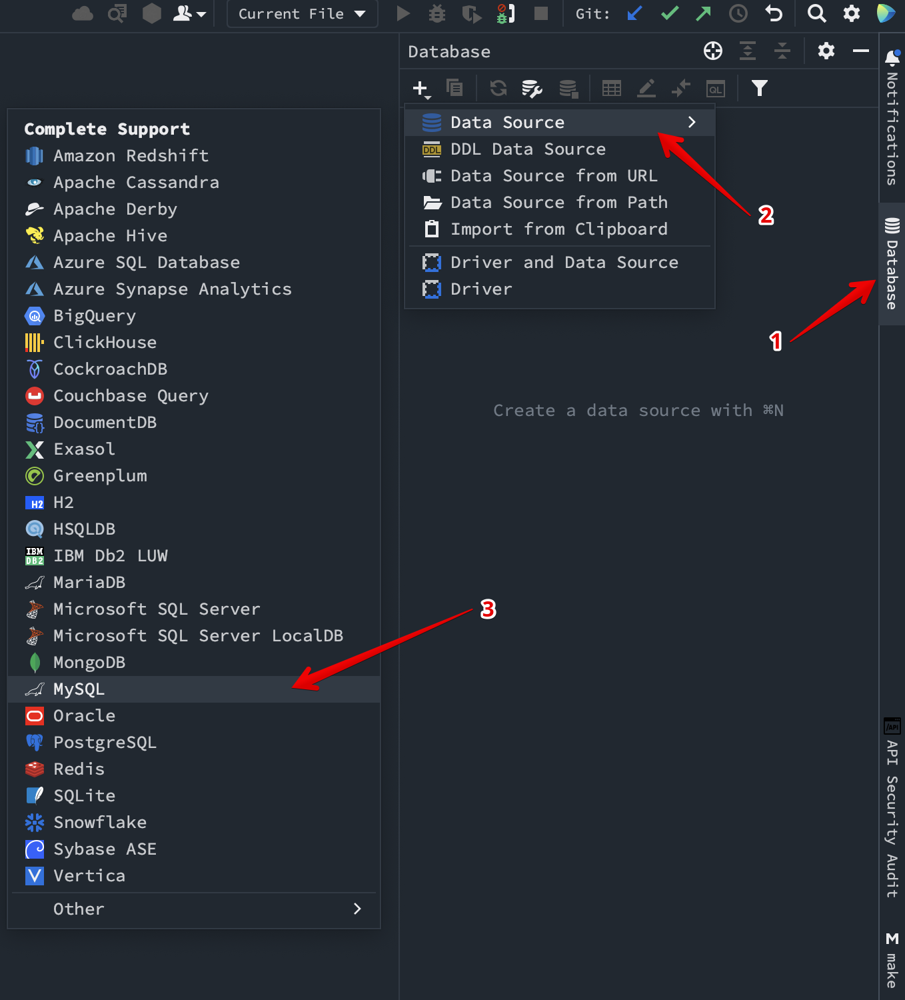
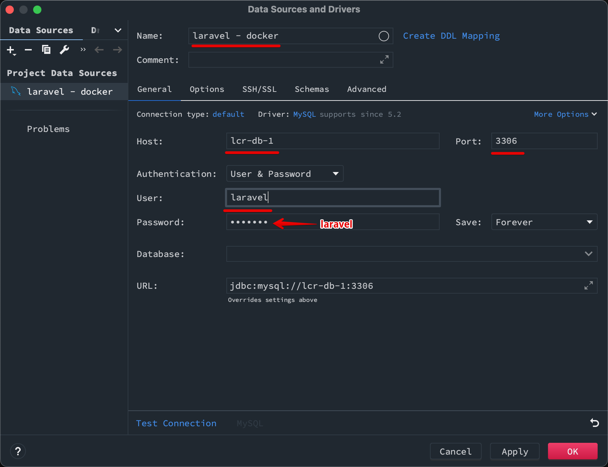
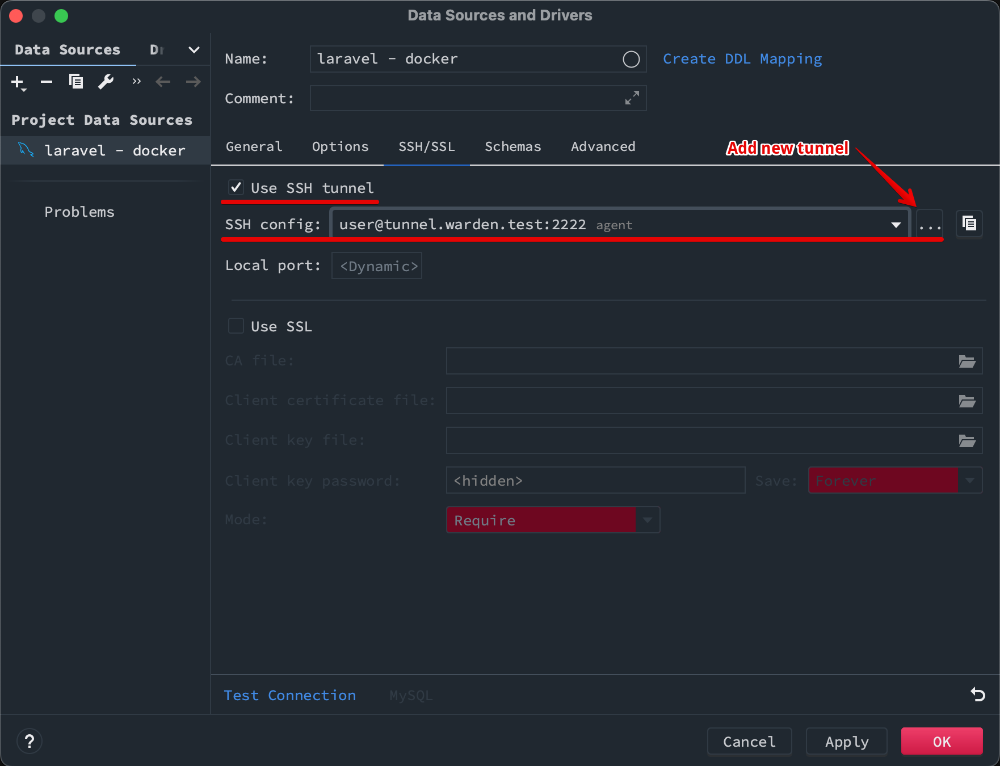
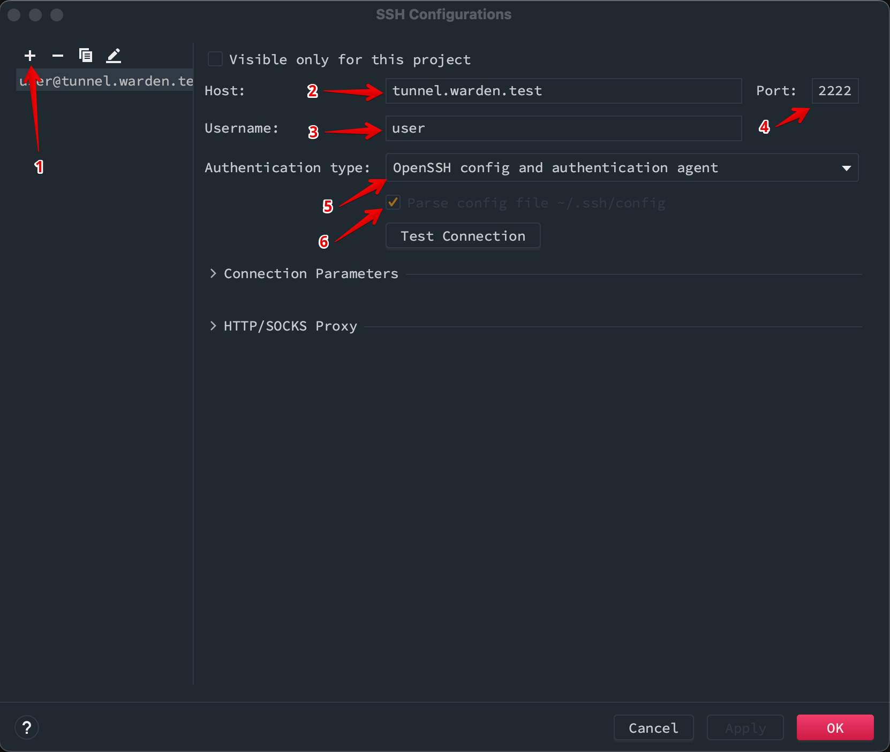

# Installation of the project

> All the required stack of applications (**PHP**, **DB**, **Redis**, **NodeJS**) are installed inside the Docker containers.
>
> All you need to do, just install the Docker, Homebrew/brew (Mac users only) and Warden. Also, Mac users will need to make a small settings adjustments in the Docker.

### Steps
1. [Install Docker](https://hub.docker.com/editions/community/docker-ce-desktop-mac/) & Increase the Memory/RAM level
1. [Install brew](https://brew.sh/#install) (Mac users only)
   ```shell
   bash -c "$(curl -fsSL https://raw.githubusercontent.com/Homebrew/install/HEAD/install.sh)"
   ```
1. [Install warden](https://docs.warden.dev/installing.html)
   ```shell
   brew update && \
   brew upgrade && \
   brew install davidalger/warden/warden
   ```
1. Install project
   ```shell
   # cd <PROJECT_ROOT> # The folder in which this README.md file is placed
   make install
   ```
1. Configure XDebug
1. Configure PHPStorm to Connect to DB

## Available services
* [https://api.lcr.test/](https://api.lcr.test/) (CLI:`make open-backend`)
* [https://webui.lcr.test/admin/](https://webui.lcr.test/) (CLI: `make open-webui`)
* [Traefik](https://traefik.warden.test/)
* [Mailhog (All emails collector)](https://mailhog.warden.test/)
* [dnsmasq](https://dnsmasq.warden.test/)
* `warden db connect` - Connect to DB
* `warden env exec php-fpm bash` - Connect to `php-fpm` container
* `warden env exec php-debug bash` - Connect to `php-debug` container for debugging CLI commands

### Docker configuration*

> *For macOS users only, if you are on Linux you ain't gonna need this

1. Open the Docker preferences.

   

1. Check the general settings

   

1. Increase the number of memory to **6+** GB

   

1. Click on `Apply & Restart` button.

### Run Docker containers/Start project
We are using [Warden](https://warden.dev/) for the project development. It is built and operates on top of the Docker Compose. For making project run you need to execute the following command.
> You may find more useful commands in the [warden documentation](https://docs.warden.dev/usage.html)
```shell
warden env up
```
*or*
```shell
make up
```
*or*
```shell
make start
```
After this, you should be able to access the project.

### Configure XDebug
The Warden environment already has a running php container with enabled XDebug.
Please, install the [XDebug helper extension](https://chrome.google.com/webstore/detail/xdebug-helper/eadndfjplgieldjbigjakmdgkmoaaaoc).
Follow the farther instructions from [Warden documentation](https://docs.warden.dev/configuration/xdebug.html).

#### Configure PHPStorm to use Xdebug


#### Enable debugging in Chrome


### Configure PHPStorm to Connect to DB

#### Add new Data Source


#### General settings


#### SSH Tunnel selection


#### New SSH Tunnel Creation


### Stop project
```shell
make stop
```
*or*
```shell
make down
```

### Uninstall project
```shell
make uninstall
```

### Laravel cron jobs
For enabling the Laravel cron jobs, please, execute the following command.
```shell
make cron-enable
```

For disabling cron jobs, please, execute the following command.
```shell
make cron-disable
```

### All the make options
```shell
make help
```
